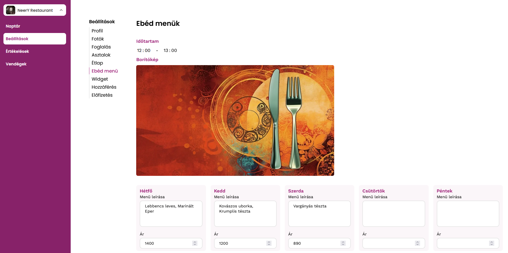
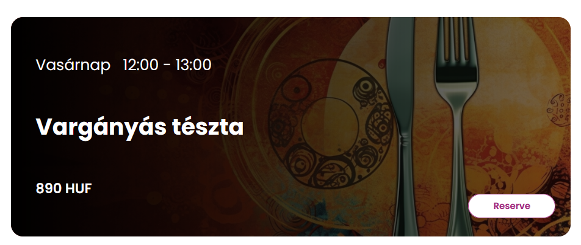

# Ebéd Menü

A hely létrehozhat minden hétre egy ebédmenüt, mely megjelenik a Widgeten.

Először is az "Időtartam"-ot kell beállítani, majd utána minden napra kitölteni a menü leírását és az árazást.
Az üresen hagyott menü elemek nem jelennek meg a widgeten.

Példa egy ebédmenü elemre a Widgeten