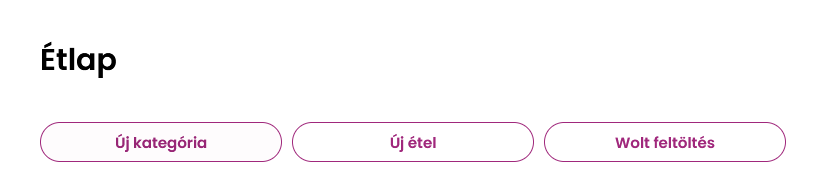
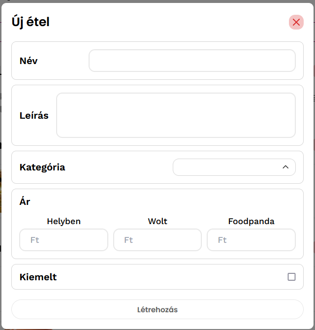
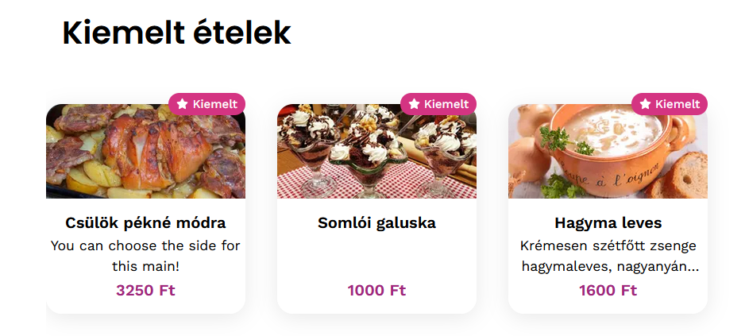
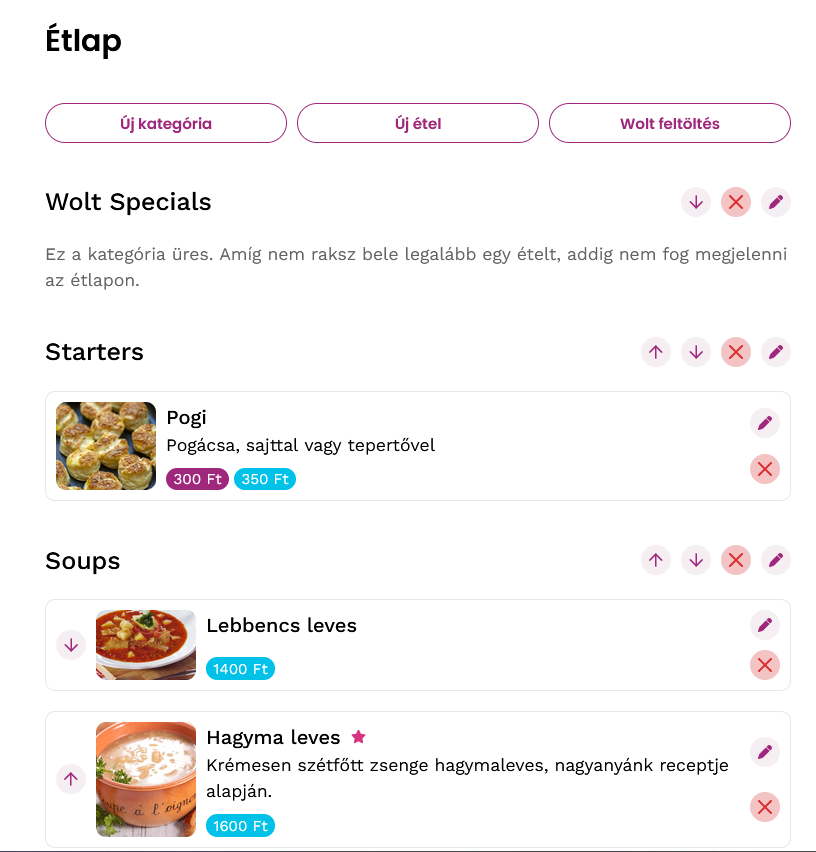

# Étlap szerkesztő

Az _"Étlap"_ menüpont esetében a saját menüdet töltheted fel hozzánk és innen egyszerűen frissítheted a különböző futár oldalakon található megjelenésedet és árazásodat, illetve az étlap megjelenik a _"Widgeten"_ is, így azt bárki könnyen elérheti.

**Fejlesztés alatt, jelenleg csak manuális szerkesztés, a _Wolt_ menü _NeerY-be_ történő feltöltése, illetve _NeerY_-ből _Wolt_-ba történő automatikus szinkronizálás működik, folyamatosan frissül!**

# Menü szerekesztő

Az étkapod szerekesztéséhez és karbantartásához jelenelg a következő opciókat kínáljuk.
- Új kategória: Étel kategóriák/csoportok létrehozás, pl: Levesek
- Új étel: Új étel létreozása
- Wolt feltöltés: a Wolt rendszeréből importálhatod a már meglevő menüdet. Lásd "_Wolt menü importálása_".

Amennyiben a _Wolt_ menüt töltik fel a NeerY rendszerbe, akkor természetesen az ottani struktúrát hozzuk létre.

## Új Étel

Étel hozzáadása vagy szerkesztése esetében 
- a Kategória csak akkor választható, ha már létezik létrehozott kategória, 
- az ár közül a Wolt-ra csak a Wolt-ár szinkronizálódik vissza, illetve a Widgeten mindig a legalacsonyabb ár jelenik meg.
- A Kiemelt mező pedig a _Widget_ főoldalán mutatja a kiemelt ételt

## Kategóriák, ételek mozgatása

Akár ételről, akár kategóriáról bbeszélünk a kezelő gombok ugyanazt jelentik.
- A "nyilakkal" lehet a kategóriákat és benne az összes ételt föl-le mozgatni, vagy az ételeket kategórián belül.
- A "ceruza" gomb az adott étel/kategória szerkesztését teszi lehetővé, míg
- Az "X" gomb az adott elem törlését, mely kategória esetén az összes benne foglalt étel törlését is jelenti.

# Wolt menü importálása a NeerY rendszerbe
Először is jelentkezz be a _"Wolt"_ admin oldalára és navigélj el a _"Menu editor"_ részre. Itt a jobb fölső sarokban találhatő "..."-ra kattintva az _"Export entire menu as JSON"_ opciót válaszd.

Ez egy szöveges file-t fog lementeni az eszközödre.

Következő lépésként kattints "_File feltöltése"_ gombra, majd tallózd be az előzőleg letöltött file-t.

Ezzel készen is vagy, feltöltötted az étlapod. Hogy megbizonyosodj róla, hogy minden a legnagyobb rendben működik nézz rá a "_Widgetre"_ és ha ott megjelent az _"Étlap"_ opció, akkor minden rendben ment.

# Szinkronizáció a Wolt felé
**Ahhoz, hogy visszaszinkronizáld az étlapodat a _Wolt_ rendszerébe előtte egy API hívás jóváhagyásra van szükség, ez néha 1-2 napig is eltarthat, ha nem menne a szinkronizáció keress fel minket!**

Amennyiben megvan a _Wolt_-tal való összeköttetés, onnantól, ha itt változtatsz bármit, akkor az visszaszinkronizálódik a Wolt rndszerébe is. Természetesen az ár esetében csak a Wolt ár.