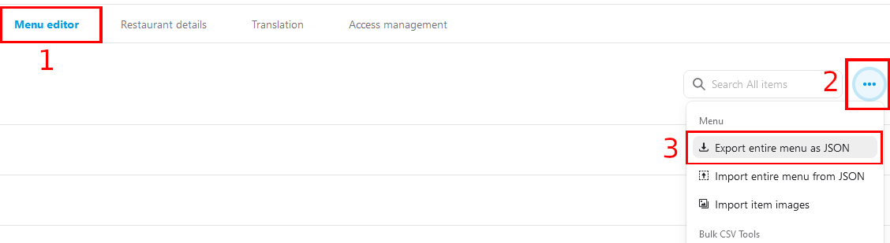

# Asztalok

Az _"Étlap"_ menüpont esetében a saját menüdet töltheted fel hozzánk és innen egyszerűen frissítheted a különböző futár oldalakon található megjelenésedet és árazásodat, illetve az étlap megjelenik a "_Digitális Névjegykártyán"_ is, így azt bárki könnyen elérheti.

**Fejlesztés alatt, jelenleg csak a _Wolt_ menü _NeerY-be_ történő átmásolása működik, folyamatosan frissül!**

# Wolt menü szinkronizálása a NeerY rendszerbe
Először is jelentkezz be a _"Wolt"_ admin oldalára és navigélj el a _"Menu editor"_ részre. Itt a jobb fölső sarokban találhatő "..."-ra kattintva az _"Export entire menu as JSON"_ opciót válaszd.

Ez egy szöveges file-t fog lementeni az eszközödre.

Következő lépésként navigálj el a _"NeerY-n"_ belül a _"Profil"_ menüpont alatt található _"Étlap"_ szekcióhoz. Itt kattints "_File feltöltése"_ gombra, majd tallózd be az előzőleg letöltött file-t.

Ezzel készen is vagy, feltöltötted az étlapod. Hogy megbizonyosodj róla, hogy minden a legnagyobb rendben működik nézz rá a "_Digitális Névjegykártáyra"_ és ha ott megjelent az _"Étlap"_ opció, akkor minden rendben ment.

**Az étlap hamarosan szerkeszthető lesz a NeerY felületén is és innen töltheted fel majd egy kattintással a Wolt vagy Foodpanda oldalára, illetve a jövőben a vendégek itt is rendelhetnek tőled akár elvitelre is!**