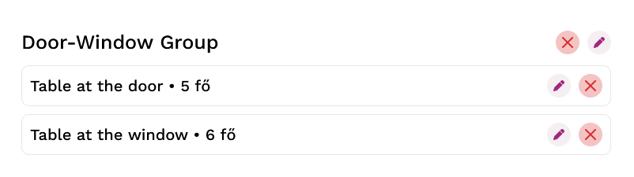

# Asztalok
Itt vihetőek fel az asztalok, amik a "_Naptár_"-ban megjelennek.

## Csoportok
A hely létrehozhat asztal csoportokat, melyek kizárólag az "_Foglalás/Autotable/Automatic_" foglalás elosztás esetében fontosak. Ha manuálisan fogadjuk/hozzuk létre a foglalást, akkor a helyre van bízva a megfelelő asztal és vendégcsoport/létszám összerendelése. Viszont, amennyiben a rendszer automatikusan fogadja a foglalásokat, akkor az egy csoportba rendezett asztalok létszáma összeadódhat.

Példa

Jelen esetben ebben a csoportban 2 asztal található. Amennyiben egy adott időpontra 2 független rendelés jön, az egyik mondjuk 4, míg a másik 6 fő, akkor a rendszer automatikusan kiosztja a 2 asztalt a 2 rendeléshez. 

Amennyiben azonban egy adott időpontra érkezik egy 10 fős rendelés, és nincs másik ekkora férőhelyű asztal, akkor a rendszer a csoportra osztja ki a foglalást és azt mindkét asztalra felteszi. Így segítve azt, hogy egymáshoz közeli, össze vagy széttolható asztalokat hozzunk létre a rendszerben a kapacitás rugalmasabb eloszlása végett.