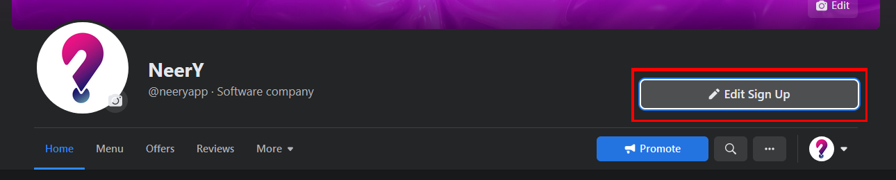
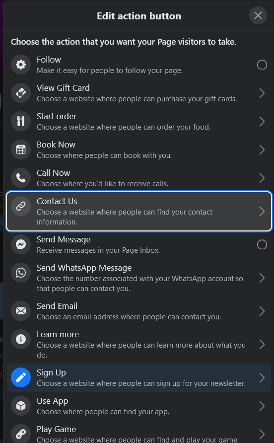
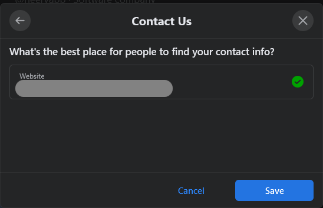

# Widget
A NeerY widget olyan esztétikus és könnyen integrálható megoldást nyúj, mellyel a potenciális vagy már meglévő vásárlóid kiszolgálása és informálása válik egyszerűvé.
Amennyiben franchise rendszerben gondolkozol és egy összesítő foglalási rendszert szeretnél, keress minket bizalommal.

A widget a NeerY szerverein fut és neked ezzel nincs más dolgod, minthogy a legenerált linket elhelyezd bárhová. Legyen ez akár egy Facebook post, Instagram info oldal, levél aláírás. Amennyiben a meglevő honlapodba szeretnéd beágyazni keress minket bizalommal.

Teszt widget példa
```html
https://places.neery.net/land/n666
```


## Példa a Digitális Névjegykártya integrációjára
Miután kimásoltad a Widget linkjét (kattints a link melletti gombra), már csak be kell illesztened a megfelelő helyre.

Legyen ez most a Facebook profil tetején található gomb.
A Facebbok oldal tetején az "_Edit ..._" gombra kattintva válasszuk ki a megfelelő opciót, például jelen esetben a "_Contact Us_"-ra esett a választás, hiszen a Digitális Névjegykártyán az összes elérhetőségünk, a foglalás és az étlep is megjelenik, amennyiben azokat megadtuk.




Majd illesszük be az előzőleg vágólapra másolt linket és mentsük el a változtatást.



Az oldalon található teszt widget mindig az adott helyhez van kötve, így itt akár egyből teszthelhed is a foglalási ciklust mielőtt kitennéd azt élesben bárhova.

### Csak a foglalási rész megjelenítése
Ha nem akarod a teljes interaktív widgetet kitenni, hanem csak a fogalásra van szükséged, akkor a link végére írd oda, hogy "/reserve".

A teljes widget linkje 
```html
https://places.neery.net/land/n666
```

Csak a foglalásé
```html
https://places.neery.net/land/n666/reserve
```